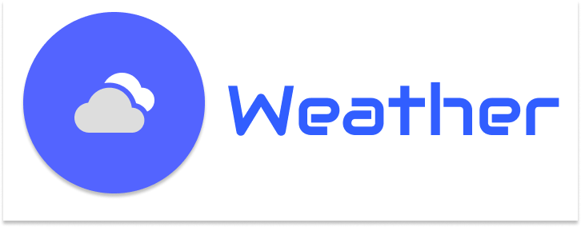

<h1 align="center"> Weather </h1>

  <a href="#-tecnologias">Tecnologias</a>&nbsp;&nbsp;&nbsp;|&nbsp;&nbsp;&nbsp;
  <a href="#-projeto">Projeto</a>&nbsp;&nbsp;&nbsp;|&nbsp;&nbsp;&nbsp;
  <a href="#-licença">Licença</a>

  

 

  

## 🚀 Tecnologias

Esse projeto foi desenvolvido com as seguintes tecnologias:

-Python

-geopy

-requests

## 💻 Projeto

O Weather é um app que recebe dados através da API openweathermap e os exibe em tela a partir de uma barra de pesquisa.

## 📝 Licença

Esse projeto está sob a licença MIT.
